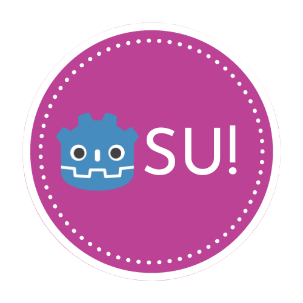

# Gosu

<div align="center">
	
</div>

Welcome to Gosu, a fun game that showcases the basics of 2D game development in Godot.

## Watch the video 📺
[](https://youtu.be/NJcLyayJhfU)

## Trying out the game 🕹️

Experience the game directly in your web browser by playing [here](https://yunusey.itch.io/gosu).

## Download 📥

Get the project by either cloning the repository:
```bash
git clone https://github.com/yunusey/gosu.git
```

Or download the project as a zip file and open it in the Godot editor.

## License 📃

This project is under the MIT license, allowing you to utilize it for any purpose and share it freely.

## Information 🔔

Gosu illustrates fundamental 2D game development features in Godot. Explore specific implementations:

- [Shaders](./Shaders)
- [2D Mesh generation using GDScript](./Scripts/HitballMesh.gd)
- [Detecting input](./Scripts/Hitball.gd)
- [Scene instancing](./Main.tscn)
- [GUI (Graphical User Interface)](./Interface.tscn)
- [Audio](./Scripts/Main.gd)
- [Custom Cursor](./project.godot)

_P.S.: As a Godot learner, I might have made mistakes. If you notice any, please consider [contributing](#contributing-🤝) to improve this project!_

## Contributing 🤝

This project is open source and welcomes any contributions.

## Final Words 💬

Thank you for visiting! If you found Gosu beneficial for the Godot community, please consider giving it a ⭐ to encourage more people to try out the game!
